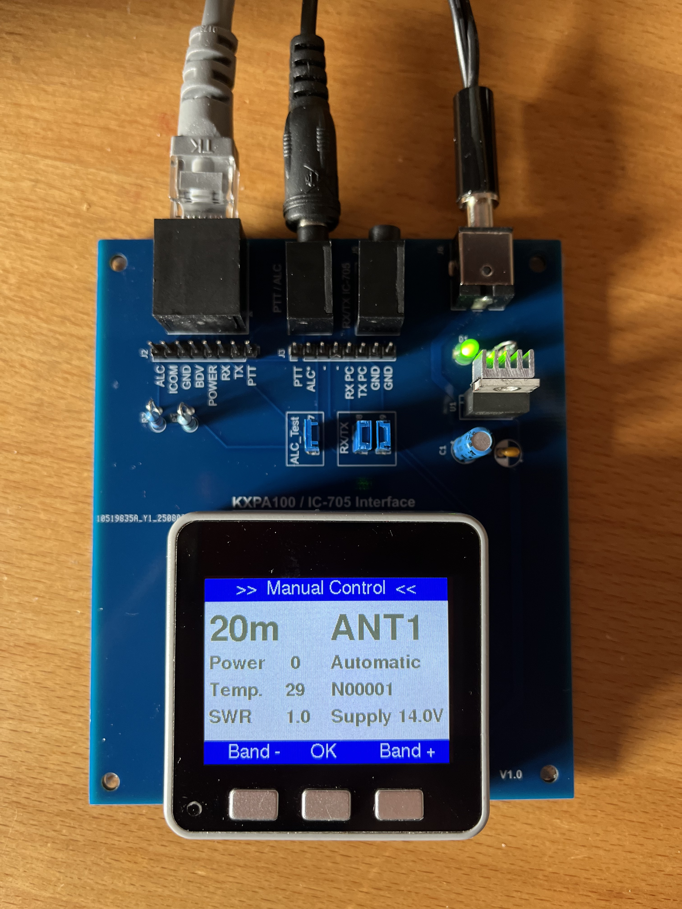
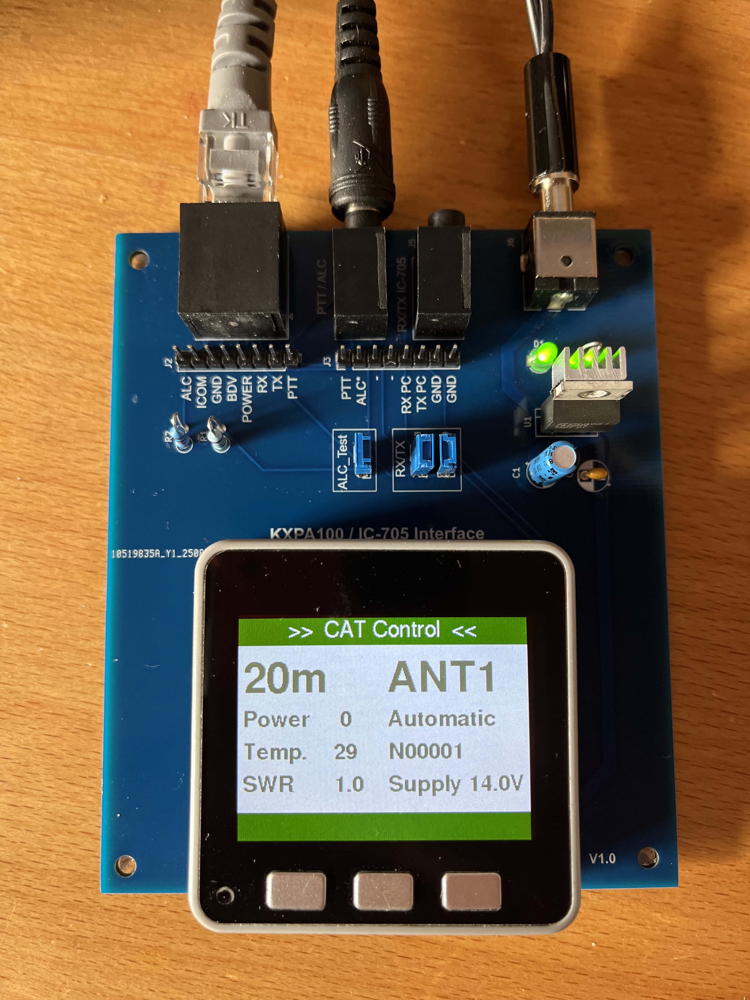
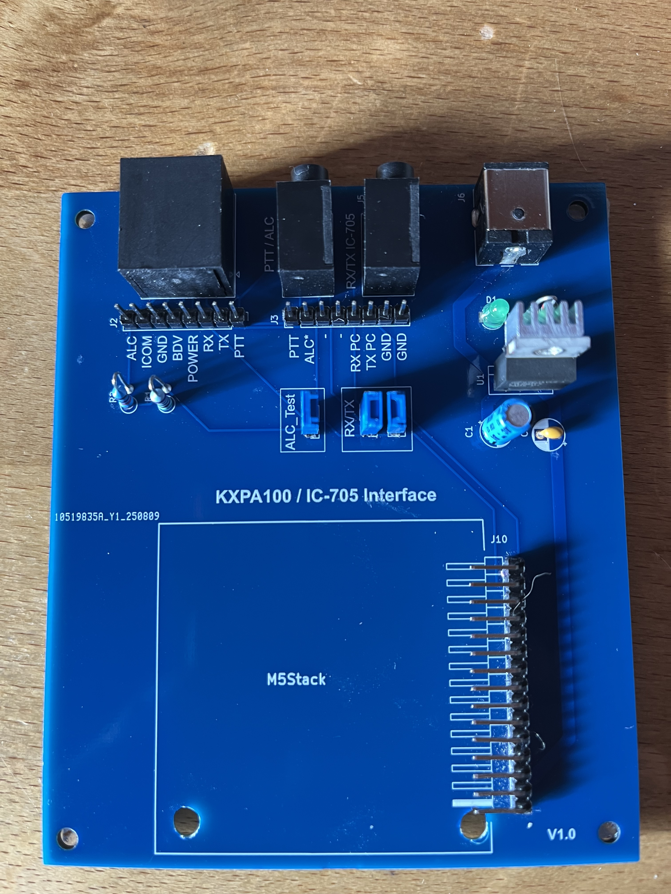

# KXPA100 Remote Control - Software Architecture

## Table of Contents
1. [System Overview](#system-overview)
2. [Architecture Diagram](#architecture-diagram)
3. [Component Description](#component-description)
4. [Data Flow](#data-flow)
5. [Threading Model](#threading-model)
6. [Communication Protocols](#communication-protocols)
7. [State Management](#state-management)
8. [Error Handling](#error-handling)
9. [Configuration](#configuration)
10. [Performance Characteristics](#performance-characteristics)

---

## System Overview

The KXPA100 Remote Control system enables wireless control of an Elecraft KXPA100 HF amplifier through an ICOM IC-705 transceiver. The system runs on an M5Stack ESP32 device and implements a dual-core architecture for responsive UI and reliable communication.






### Key Features
- **Dual-Core Architecture**: Separate cores for UI (Core 1) and backend communication (Core 0)
- **Automatic Band Switching**: Frequency-based band selection via CAT protocol
- **Manual Override**: Button-controlled band selection when CAT is unavailable
- **Real-time Monitoring**: Display of SWR, power, temperature, and operational status
- **Thread-Safe Data Exchange**: Mutex-protected shared state between cores
- **Fault Tolerance**: Automatic reconnection, retry logic, and graceful degradation

### System Specifications
- **Platform**: ESP32 Dual-Core (M5Stack)
- **Display**: 320x240 TFT LCD
- **Communication**: 
  - WiFi 802.11 b/g/n (2.4GHz)
  - UART Serial (38400 baud, inverted)
- **Power Management**: Automatic shutdown after 30s of disconnection

---

## Architecture Diagram

```
────────────────────────────────────────────────────────────────────────────┐
│                        M5Stack ESP32 Hardware                             │
│                                                                           │
│  ┌───────────────────────────────┐      ┌──────────────────────────────┐  │
│  │        Core 1 - UI Task       │      │     Core 0 - Backend Task    │  │
│  │        (High Priority)        │      │    (Communication Handler)   │  │
│  │                               │      │                              │  │
│  │  ┌─────────────────────┐      │      │  ┌────────────────────┐      │  │
│  │  │   Button Handler    │      │      │  │   CAT WiFi Client  │      │  │
│  │  │   - BtnA (Band+)    │      │      │  │   - WiFi STA       │      │  │
│  │  │   - BtnB (OK)       │      │      │  │   - TCP Socket     │      │  │
│  │  │   - BtnC (Band-)    │      │      │  │   - State Machine  │      │  │
│  │  └──────────┬──────────┘      │      │  └──────────┬─────────┘      │  │
│  │             │                 │      │             │                │  │
│  │             ▼                 │      │             ▼                │  │
│  │  ┌─────────────────────┐      │      │  ┌────────────────────┐      │  │
│  │  │   Display Manager   │      │      │  │   KXPA Controller  │      │  │
│  │  │   - Canvas Sprites  │      │      │  │   - Serial UART    │      │  │
│  │  │   - Dirty Flags     │      │      │  │   - Command Parser │      │  │
│  │  │   - 500ms Update    │      │      │  │   - Band Logic     │      │  │
│  │  └──────────┬──────────┘      │      │  └──────────┬─────────┘      │  │
│  │             │                 │      │             │                │  │
│  └─────────────┼─────────────────┘      └─────────────┼────────────────┘  │
│                │                                      │                   │
│                └──────────┬───────────────────────────┘                   │
│                           ▼                                               │
│                ┌──────────────────────┐                                   │
│                │   Semaphore Mutex    │                                   │
│                │   (Thread Safety)    │                                   │
│                └──────────┬───────────┘                                   │
│                           │                                               │
│                           ▼                                               │
│                ┌──────────────────────┐                                   │
│                │     Shared State     │                                   │
│                │    - Band Info       │                                   │
│                │    - Status Data     │                                   │
│                │    - Dirty Flags     │                                   │
│                │    - Request Flags   │                                   │
│                └──────────────────────┘                                   │
│                                                                           │
│  ┌──────────────────────┐                ┌──────────────────────┐         │
│  │   Serial2 UART       │                │      WiFi Radio      │         │
│  │   RX: GPIO 16        │                │      STA Mode        │         │
│  │   TX: GPIO 17        │                │      2.4GHz          │         │
│  │   38400 Baud Inv.    │                │                      │         │
│  └──────────┬───────────┘                └──────────┬───────────┘         │
└─────────────┼───────────────────────────────────────┼─────────────────────┘
              │                                       │
              ▼                                       ▼
   ┌──────────────────────┐                ┌──────────────────────┐
   │  KXPA100 Amplifier   │                │     WiFi Router      │
   │  - Band Selection    │                │    192.168.188.33     │
   │  - Status Reporting  │                │                      │
   │  - Fault Monitoring  │                └──────────┬───────────┘
   └──────────────────────┘                           │
                                                      ▼
                                           ┌──────────────────────┐
                                           │      CAT Server      │
                                           │    rigctld:2020      │
                                           │    192.168.188.33    │
                                           └──────────┬───────────┘
                                                      │
                                                      ▼
                                           ┌──────────────────────┐
                                           │  IC-705 Transceiver  │
                                           │   Frequency Source   │
                                           └──────────────────────┘

```

---

## Component Description

### 1. Core 1 - UI Task (High Priority)

#### Responsibilities
- Handle button input (band selection, confirmation)
- Manage display rendering
- Implement power management logic
- Provide user feedback

#### Key Classes/Functions
```cpp
void loop()                    // Main UI loop on Core 1
void drawLeftSprite()          // Render left display area
void drawRightSprite()         // Render right display area
void showStatusLine()          // Display status bar
void showPowerOffWarning()     // Warning before shutdown
```

#### Timing Characteristics
- **Loop Frequency**: ~100Hz (limited by M5.update())
- **Display Update**: 500ms intervals or on dirty flags
- **Button Debounce**: Hardware debounce + 400ms initial delay
- **Button Repeat**: 150ms intervals when held

#### Input Handling
```cpp
// Button Mapping
BtnA (Left)   → Band Increment (160m → 6m)
BtnB (Center) → Confirm Selection
BtnC (Right)  → Band Decrement (6m → 160m)

// Button Repeat Logic
- Initial Press → Immediate action
- Hold 400ms   → Start repeating
- Repeat Rate  → 150ms intervals
```

### 2. Core 0 - Backend Task (Communication)

#### Responsibilities
- WiFi connection management (non-blocking)
- CAT protocol communication
- KXPA100 serial communication
- Band calculation and switching logic
- Status polling and aggregation

#### Key Classes
```cpp
class CatWifiClient {
  void begin()                  // Initialize WiFi
  void update()                 // Non-blocking state machine
  bool isConnected()            // Connection status
  String sendCommand()          // Send CAT command
}

class KXPA100Controller {
  void begin()                  // Initialize serial
  bool checkConnection()        // Health check
  void setBand(int idx)         // Band switching with retry
  String getSWR()               // Read SWR value
  String getPower()             // Read power output
  String getTemperature()       // Read PA temperature
  int getBandIndexByFrequency() // Freq → Band mapping
}
```

#### Polling Strategy
```cpp
// Backend Task Loop
200ms polling interval (optimized from 50ms)
  ├─ Update WiFi state machine (non-blocking)
  ├─ Check manual band change request
  ├─ Poll KXPA100 status (if connected)
  ├─ Query CAT frequency (if connected)
  ├─ Calculate and apply band changes
  └─ Update shared state with dirty flags
```

### 3. Shared State Management

#### Data Structure
```cpp
struct SharedData {
  // Status Data
  int bandIndex;              // Current band (0-10)
  String bandName;            // "160m", "80m", etc.
  String power;               // Power output in W
  String temp;                // Temperature in °C
  String swr;                 // SWR ratio
  String antenna;             // "ANT1" or "ANT2"
  String mode;                // "Bypass", "Manual", "Automatic"
  String faults;              // Fault codes
  String voltage;             // Supply voltage
  
  // Connection State
  bool catConnected;          // CAT link status
  bool kxpaConnected;         // KXPA link status
  
  // Request Flags
  volatile bool manualChangeReq;  // Band change request
  int manualTargetBand;           // Target band index
  
  // Dirty Flags (for optimized rendering)
  bool bandDirty;
  bool powerDirty;
  bool tempDirty;
  bool swrDirty;
  bool antennaDirty;
  bool modeDirty;
  bool faultsDirty;
  bool voltageDirty;
  bool connectionDirty;
};
```

#### Access Pattern
```cpp
// Writing to Shared State (Backend Task)
if (xSemaphoreTake(dataMutex, SEMAPHORE_TIMEOUT_TICKS)) {
  if (sharedState.power != newPower) {
    sharedState.power = newPower;
    sharedState.powerDirty = true;  // Mark for UI update
  }
  xSemaphoreGive(dataMutex);
}

// Reading from Shared State (UI Task)
String localPower;
if (xSemaphoreTake(dataMutex, SEMAPHORE_TIMEOUT_TICKS)) {
  localPower = sharedState.power;
  sharedState.powerDirty = false;  // Clear after read
  xSemaphoreGive(dataMutex);
}
```

---

## Data Flow

### 1. Automatic Band Switching (CAT Mode)

```
IC-705 (Frequency Change)
    │
    ▼
CAT Server (rigctld)
    │ TCP Port 2020
    ▼
CatWifiClient.sendCommand("f\n")
    │
    ▼
Parse Frequency (e.g., "14250000")
    │
    ▼
KXPA100Controller.getBandIndexByFrequency(14250000)
    │
    ▼
Band Index = 5 (20m band: 14.000-14.350 MHz)
    │
    ▼
KXPA100Controller.setBand(5)
    │
    ▼
Serial Command: "^BN05;" + "^AN1;"
    │
    ▼
KXPA100 Amplifier (Band Relay Switch)
    │
    ▼
Confirmation: "^BN05"
    │
    ▼
Update SharedState (bandIndex=5, bandName="20m")
    │
    ▼
UI Display Update
```

### 2. Manual Band Switching

```
User Presses BtnA/BtnC (UI Task, Core 1)
    │
    ▼
uiBandCounter increment/decrement
    │
    ▼
uiUpdatingBand = true (RED highlight)
    │
    ▼
User Presses BtnB (Confirm)
    │
    ▼
Acquire Mutex
    │
    ▼
Set sharedState.manualChangeReq = true
Set sharedState.manualTargetBand = uiBandCounter
    │
    ▼
Release Mutex
    │
    ▼
Backend Task (Core 0) detects request
    │
    ▼
KXPA100Controller.setBand(target)
    │
    ▼
Verify band was set (retry up to 3 times)
    │
    ▼
Update SharedState
    │
    ▼
UI reflects new band (DARKGREY color)
```

### 3. Status Monitoring Loop

```
Backend Task (200ms interval)
    │
    ├─ KXPA100Controller.checkConnection()  → "^I;" → "^IKXPA100"
    ├─ KXPA100Controller.getSWR()           → "^SW;" → "^SW015" (1.5)
    ├─ KXPA100Controller.getPower()         → "^PF;" → "^PF0750" (75W)
    ├─ KXPA100Controller.getTemperature()   → "^TM;" → "^TM0450" (45°C)
    ├─ KXPA100Controller.getAntenna()       → "^AN;" → "^AN1;"
    ├─ KXPA100Controller.getMode()          → "^MD;" → "^MDA" (Automatic)
    ├─ KXPA100Controller.getFaultCodes()    → "^FL;" → "^FL00;"
    └─ KXPA100Controller.getVoltage()       → "^SV;" → "^SV13500" (13.5V)
    │
    ▼
Parse and validate all values
    │
    ▼
Acquire Mutex
    │
    ▼
Update SharedState with dirty flags
    │
    ▼
Release Mutex
    │
    ▼
UI Task reads dirty flags
    │
    ▼
Re-render only changed display elements
```

---

## Threading Model

### Core Assignment

| Core | Task | Priority | Stack Size | Frequency |
|------|------|----------|------------|-----------|
| Core 1 | UI Loop | Default | Default | ~100 Hz |
| Core 0 | Backend Task | 1 | 8192 bytes | 5 Hz (200ms) |

### Synchronization Mechanism

```cpp
// Mutex Configuration
SemaphoreHandle_t dataMutex;
#define MUTEX_TIMEOUT_MS 50
#define SEMAPHORE_TIMEOUT_TICKS pdMS_TO_TICKS(MUTEX_TIMEOUT_MS)

// Critical Section Pattern
if (xSemaphoreTake(dataMutex, SEMAPHORE_TIMEOUT_TICKS)) {
  // Access shared data
  xSemaphoreGive(dataMutex);
} else {
  // Timeout handling - non-critical, skip update
}
```

### Race Condition Prevention

**Problem**: Manual band change could be overwritten by backend polling

**Solution**: Request Flag Pattern
```cpp
// UI Task (Core 1)
sharedState.manualTargetBand = 7;
sharedState.manualChangeReq = true;  // Set AFTER data

// Backend Task (Core 0)
if (sharedState.manualChangeReq) {
  // Process request
  sharedState.manualChangeReq = false;  // Clear BEFORE update
}

// Later in same iteration
if (!sharedState.manualChangeReq) {  // Double-check
  // Only update if no new request arrived
  sharedState.bandIndex = polledBand;
}
```

### Deadlock Prevention

1. **Fixed Timeout**: All mutex acquisitions use 50ms timeout
2. **No Nested Locks**: Never acquire mutex while holding another
3. **Short Critical Sections**: Minimize time in mutex-protected code
4. **Non-Blocking WiFi**: State machine prevents blocking in event handlers

---

## Communication Protocols

### 1. KXPA100 Serial Protocol

#### Connection Parameters
```cpp
Port:      Serial2 (HardwareSerial)
Baud Rate: 38400
Data Bits: 8
Parity:    None
Stop Bits: 1
Inverted:  true (RS-232 level inversion)
Timeout:   100ms
```

#### Command Format
```
Command:   ^XX;       (^ prefix, 2-char command, semicolon terminator)
Response:  ^XXvalue;  (echo of command + value + semicolon)

Examples:
  ^I;      → ^IKXPA100         (Identification)
  ^BN;     → ^BN05             (Get Band = 20m)
  ^BN05;   → ^BN05             (Set Band to 20m)
  ^SW;     → ^SW015            (SWR = 1.5)
  ^PF;     → ^PF0750           (Power = 75.0W)
  ^TM;     → ^TM0450;          (Temperature = 45.0°C)
  ^SV;     → ^SV13500          (Voltage = 13.5V)
```

#### Command Set
| Command | Description | Response Format | Units |
|---------|-------------|-----------------|-------|
| `^I;` | Identify | `^IKXPA100` | - |
| `^BN;` | Get Band | `^BN00-10` | Band Index |
| `^BN0X;` | Set Band | `^BN0X` | Band Index |
| `^AN;` | Get Antenna | `^AN1;` or `^AN2;` | Antenna Port |
| `^AN1;` | Set Antenna 1 | `^AN1;` | - |
| `^AN2;` | Set Antenna 2 | `^AN2;` | - |
| `^MD;` | Get Mode | `^MDB/M/A` | Bypass/Manual/Auto |
| `^MDB;` | Set Bypass | `^MDB` | - |
| `^MDM;` | Set Manual | `^MDM` | - |
| `^MDA;` | Set Automatic | `^MDA` | - |
| `^SW;` | Get SWR | `^SW000-999` | SWR × 10 |
| `^PF;` | Get Power Forward | `^PF0000-9999` | Watts × 10 |
| `^TM;` | Get Temperature | `^TM0000;` | °C × 10 |
| `^SV;` | Get Supply Voltage | `^SV00000` | Volts × 1000 |
| `^FL;` | Get Fault Codes | `^FL00-99;` | Fault Bitmap |

#### Error Handling
```cpp
String txRx(const char* cmd) {
  // 1. Check port availability
  if (!_port) return "";
  
  // 2. Flush RX buffer
  while (_port.available()) _port.read();
  
  // 3. Send command
  size_t written = _port.write(cmd);
  if (written != strlen(cmd)) return "";
  
  // 4. Wait for response
  delay(_delayComm);  // 20ms
  
  // 5. Read response with timeout
  String resp = _port.readStringUntil(';');
  if (resp.length() == 0) {
    Serial.println("No response");
    return "";
  }
  
  return resp;
}
```

### 2. CAT Protocol (WiFi)

#### Connection Parameters
```cpp
Protocol:    TCP
Server:      192.168.188.33
Port:        2020
Timeout:     10000ms
Mode:        WiFi Station (STA)
Reconnect:   Exponential backoff (500ms to 30s)
```

#### State Machine
```
DISCONNECTED → WiFi.begin()
    ↓
WIFI_CONNECTED → READY_TO_CONNECT
    ↓
READY_TO_CONNECT → socket.connect() [with backoff]
    ↓
CONNECTING → Wait for connection (2s timeout)
    ↓
CONNECTED → Operational
    ↓ (on disconnect)
READY_TO_CONNECT (retry with backoff)
```

#### Command Set (rigctld)
```
Command:  f\n                  (Get Frequency)
Response: 14250000\n           (Frequency in Hz)

Command:  m\n                  (Get Mode)
Response: USB\n2400\n          (Mode + Passband)
```

#### Reconnection Strategy
```cpp
Retry Backoff Sequence:
  Attempt 0: 500ms
  Attempt 1: 1s
  Attempt 2: 2s
  Attempt 3: 4s
  Attempt 4: 8s
  Attempt 5: 16s
  Attempt 6+: 30s (capped)

Max Retries: 10 attempts before extended backoff
```

---

## State Management

### Band Table

```cpp
const BandInfo _bandTable[] = {
  // {lowerFreq, upperFreq, name, bandCmd, antennaCmd}
  {1800000,   2000000,   "160m", "^BN00;", "^AN1;"},  // 160m
  {3500000,   3800000,   "80m",  "^BN01;", "^AN1;"},  // 80m
  {5351500,   5366500,   "60m",  "^BN02;", "^AN1;"},  // 60m
  {7000000,   7200000,   "40m",  "^BN03;", "^AN1;"},  // 40m
  {10100000,  10150000,  "30m",  "^BN04;", "^AN1;"},  // 30m
  {14000000,  14350000,  "20m",  "^BN05;", "^AN1;"},  // 20m
  {18068000,  18168000,  "17m",  "^BN06;", "^AN1;"},  // 17m
  {21000000,  21450000,  "15m",  "^BN07;", "^AN1;"},  // 15m
  {24890000,  24990000,  "12m",  "^BN08;", "^AN1;"},  // 12m
  {28000000,  29700000,  "10m",  "^BN09;", "^AN1;"},  // 10m
  {50000000,  52000000,  "6m",   "^BN10;", "^AN2;"}   // 6m
};
```

### Frequency to Band Mapping
```cpp
int getBandIndexByFrequency(uint32_t freq) {
  for (size_t i = 0; i < _bandCount; ++i) {
    if (freq >= _bandTable[i].lowerFreq && 
        freq <= _bandTable[i].upperFreq) {
      return i;
    }
  }
  return -1;  // Frequency not in any ham band
}
```

### Display State Machine

```
┌─────────────────┐
│  KXPA Connected │
│     NO          │
└────────┬────────┘
         │
         ▼
┌─────────────────┐
│ Show "No KXPA"  │
│ Red Status Bar  │
│ Blank Display   │
└─────────────────┘

┌─────────────────┐
│  KXPA Connected │
│     YES         │
└────────┬────────┘
         │
         ├──────────┬──────────┐
         ▼          ▼          ▼
    ┌────────┐ ┌────────┐ ┌──────────┐
    │ CAT ON │ │CAT OFF │ │ Updating │
    │        │ │ Manual │ │  Band    │
    └────────┘ └────────┘ └──────────┘
         │          │          │
         ▼          ▼          ▼
    Green Bar  Blue Bar   Red Text
    No Buttons Buttons   Manual Val
                Enabled
```

---

## Error Handling

### 1. Serial Communication Errors

```cpp
// Timeout Handling
String resp = _port.readStringUntil(';');
if (resp.length() == 0) {
  Serial.println("No response for command");
  return "";  // Return empty, caller handles
}

// Validation
float swr = s.toFloat() / 10.0f;
if (swr < 1.0 || swr > 99.9) {
  Serial.println("Invalid SWR value");
  return "ERR";  // Display error on screen
}

// Retry Logic
for (uint8_t attempt = 0; attempt < MAX_RETRIES; attempt++) {
  // Send command
  int actualBand = getBand();
  if (actualBand == targetBand) {
    return;  // Success
  }
  delay(50);
}
Serial.println("Failed after retries");
```

### 2. WiFi Connection Errors

```cpp
// Non-Blocking State Machine
switch (_socketState) {
  case CONNECTING:
    if (now - _lastConnectAttempt >= CONNECT_TIMEOUT_MS) {
      Serial.println("Socket connect timeout");
      _socket.stop();
      _socketState = READY_TO_CONNECT;
      _retryCount++;
      
      if (_retryCount >= MAX_RETRIES) {
        // Extended backoff after max retries
      }
    }
    break;
}

// Exponential Backoff
unsigned long _getBackoffDelay() {
  unsigned long backoff = INITIAL_BACKOFF_MS * (1 << min(_retryCount, 6));
  return min(backoff, MAX_BACKOFF_MS);
}
```

### 3. Power Management

```cpp
// Watchdog Timer
if (s_kxpaConn) {
  timerLastKxpaConnection = millis();  // Reset
  powerOffWarningShown = false;
}

unsigned long disconnectTime = millis() - timerLastKxpaConnection;

// Warning at 25 seconds
if (disconnectTime > POWEROFF_WARNING_MS && !powerOffWarningShown) {
  showPowerOffWarning();
  powerOffWarningShown = true;
}

// Shutdown at 30 seconds (with abort option)
if (disconnectTime > POWEROFF_TIMEOUT_MS) {
  if (anyButtonPressed()) {
    timerLastKxpaConnection = millis();  // Abort
  } else {
    M5.Power.powerOff();  // Shutdown
  }
}
```

### 4. Mutex Timeout Handling

```cpp
// Non-Critical: Skip update on timeout
if (xSemaphoreTake(dataMutex, SEMAPHORE_TIMEOUT_TICKS)) {
  // Update shared state
  xSemaphoreGive(dataMutex);
} else {
  // Timeout - skip this update cycle
  // Will retry on next iteration
}
```

---

## Configuration

### Compile-Time Configuration

```cpp
// Hardware Pins
#define RX_PIN 16                    // UART RX (from KXPA)
#define TX_PIN 17                    // UART TX (to KXPA)

// Serial Configuration
#define BAUD_RATE 38400              // KXPA baud rate
#define DELAY_COMM_MS 20             // Inter-command delay
#define INVERTED true                // RS-232 level inversion

// Timing
#define DISPLAY_UPDATE_MS 500        // UI refresh rate
#define BACKEND_POLL_MS 200          // Status polling rate
#define POWEROFF_TIMEOUT_MS 30000    // Auto-shutdown timeout
#define POWEROFF_WARNING_MS 25000    // Warning before shutdown

// Mutex
#define MUTEX_TIMEOUT_MS 50          // Semaphore timeout

// Button Repeat
#define BTN_REPEAT_DELAY_INITIAL_MS 400  // Initial delay
#define BTN_REPEAT_RATE_MS 150           // Repeat rate

// Display
#define IMG0_WIDTH 320               // Status bar width
#define IMG0_HEIGHT 30               // Status bar height
#define IMG1_WIDTH 160               // Left panel width
#define IMG1_HEIGHT 180              // Left panel height
#define IMG1a_WIDTH 160              // Right panel width
#define IMG1a_HEIGHT 180             // Right panel height
#define IMG2_WIDTH 320               // Button bar width
#define IMG2_HEIGHT 30               // Button bar height
```

### Runtime Configuration (Secrets.h)

```cpp
// WiFi Credentials
const char* ssid = "your-wifi-ssid";
const char* password = "your-wifi-password";

// CAT Server
const char* CAT_SERVER = "xxx.xxx.xxx.xxx";
const uint16_t RIGCTLD_PORT = xxxx;
```

---

## Performance Characteristics

### CPU Utilization

| Task | Core | CPU Usage | Notes |
|------|------|-----------|-------|
| UI Loop | 1 | ~10-15% | Display updates at 500ms |
| Backend Task | 0 | ~5-8% | Polling at 200ms |
| WiFi Stack | 0 | ~3-5% | When connected |
| Idle | Both | ~70-80% | FreeRTOS idle task |

### Memory Usage

```
Flash (Program):  ~600 KB
SRAM (Data):      ~50 KB
  ├─ Task Stacks: ~12 KB (8KB backend + 4KB UI)
  ├─ Display Sprites: ~25 KB (4 sprites, 8-bit depth)
  ├─ WiFi Buffers: ~8 KB
  └─ Heap/Global: ~5 KB

Heap Fragmentation: Minimal (String reserve prevents)
```

### Latency Characteristics

| Operation | Latency | Notes |
|-----------|---------|-------|
| Button Response | <10ms | Immediate button read |
| Display Update | <50ms | After button press |
| Band Switch (Manual) | 50-150ms | Including retry logic |
| Band Switch (CAT) | 200-400ms | Including freq query |
| KXPA Status Poll | 20-40ms | Per command × 8 commands |
| WiFi Reconnect | 500ms-30s | Exponential backoff |
| Power-Off Warning | 25s | From last KXPA response |
| Auto Shutdown | 30s | From last KXPA response |

### Network Performance

```
WiFi Throughput:    ~1-5 Mbps (not bandwidth-limited)
TCP Latency:        ~10-50ms (LAN)
CAT Query Rate:     ~5 Hz (200ms interval)
Packet Size:        <100 bytes per query
Bandwidth Usage:    <1 KB/s average
```

---

## Development Guidelines

### Adding New KXPA Commands

1. **Define Command in Header**
```cpp
// In KXPA100Controller.h
String getNewParameter();
```

2. **Implement Command**
```cpp
// In KXPA100Controller.cpp
String KXPA100Controller::getNewParameter() {
  String p = txRx("^NP;");  // New Parameter command
  if (p.length() == 0) return "0";
  
  p.replace("^NP", "");
  float val = p.toFloat() / 10.0f;
  
  // Sanity check
  if (val < MIN_VAL || val > MAX_VAL) {
    Serial.println("Invalid value");
    return "ERR";
  }
  
  return String(val, 1);
}
```

3. **Add to SharedData**
```cpp
struct SharedData {
  // ...
  String newParameter;
  bool newParameterDirty;
};
```

4. **Poll in Backend Task**
```cpp
String p_newParam = kxpa.getNewParameter();

// Update shared state
if (sharedState.newParameter != p_newParam) {
  sharedState.newParameter = p_newParam;
  sharedState.newParameterDirty = true;
}
```

5. **Display in UI**
```cpp
if (sharedState.newParameterDirty) {
  img1a.drawString(s_newParam, LINE_LEFT_X, LINE5_Y);
  sharedState.newParameterDirty = false;
}
```

### Testing Checklist

- [ ] KXPA connection on boot
- [ ] Manual band switching (all 11 bands)
- [ ] Button repeat functionality
- [ ] CAT automatic band switching
- [ ] CAT to Manual transition
- [ ] WiFi reconnection after disconnect
- [ ] KXPA reconnection after power cycle
- [ ] Power-off warning display
- [ ] Power-off abort with button press
- [ ] All status values display correctly
- [ ] SWR/Power/Temp validation
- [ ] Fault code display
- [ ] Mode display (Bypass/Manual/Auto)
- [ ] Antenna display (ANT1/ANT2)
- [ ] Supply voltage display

---

## Troubleshooting Guide

### Problem: Display shows "No KXPA100"

**Causes:**
1. Serial cable not connected
2. KXPA100 powered off
3. Wrong baud rate (should be 38400)
4. Inverted logic mismatch

**Debug:**
```cpp
// In setup(), add:
if (!kxpa.checkConnection()) {
  Serial.println("KXPA100 not responding to ^I; command");
  // Check serial port configuration
  Serial.print("RX Pin: "); Serial.println(RX_PIN);
  Serial.print("TX Pin: "); Serial.println(TX_PIN);
  Serial.print("Baud: "); Serial.println(BAUD_RATE);
}
```

### Problem: WiFi won't connect

**Causes:**
1. Wrong SSID/password in Secrets.h
2. Router out of range
3. 5GHz network (ESP32 only supports 2.4GHz)

**Debug:**
```cpp
// In CatWifiClient::update(), add:
Serial.print("WiFi Status: ");
Serial.println(WiFi.status());
Serial.print("Retry Count: ");
Serial.println(_retryCount);
```

### Problem: Band switching doesn't work

**Causes:**
1. CAT mode active (buttons disabled)
2. Band index out of range
3. KXPA not in automatic mode

**Debug:**
```cpp
// Check CAT status
if (s_catConn) {
  Serial.println("CAT is active - buttons disabled");
}

// Check band range
Serial.print("Band Index: ");
Serial.println(uiBandCounter);
```

### Problem: Display freezes

**Causes:**
1. Mutex deadlock (should be prevented)
2. Watchdog timeout
3. Stack overflow

**Debug:**
```cpp
// In both tasks, add:
Serial.print("Free Heap: ");
Serial.println(ESP.getFreeHeap());
Serial.print("Stack HWM: ");
Serial.println(uxTaskGetStackHighWaterMark(NULL));
```

---

## Future Enhancements

### Planned Features
1. **Logging System**: SD card logging of power, SWR, temperature
2. **Web Interface**: HTTP server for remote monitoring
3. **OTA Updates**: Wireless firmware updates
4. **Configuration Portal**: WiFi credentials via web UI
5. **Graphing**: Real-time SWR/Power charts
6. **Alerts**: Configurable thresholds for SWR/Temp warnings
7. **Multi-language**: UI localization support

### Performance Optimizations
1. **Partial Sprite Updates**: Only redraw changed regions
2. **DMA Display**: Use DMA for faster sprite transfers
3. **Compressed Fonts**: Reduce flash usage
4. **PSRAM**: Use external RAM for larger buffers

---

## License & Credits

**Author:** René Mederlet, HB9HGW  
**Version:** 1.3 (Improved)  
**Date:** 2025  
**License:** MIT License (see LICENSE file)  

**Hardware:**
- M5Stack Basic/Core2/CoreS3
- Elecraft KXPA100 HF Amplifier
- ICOM IC-705 Transceiver

**Software Dependencies:**
- M5Unified library
- Arduino ESP32 core
- FreeRTOS

---

## Contact & Support

For questions, issues, or contributions:
- **QRZ:** HB9HGW


